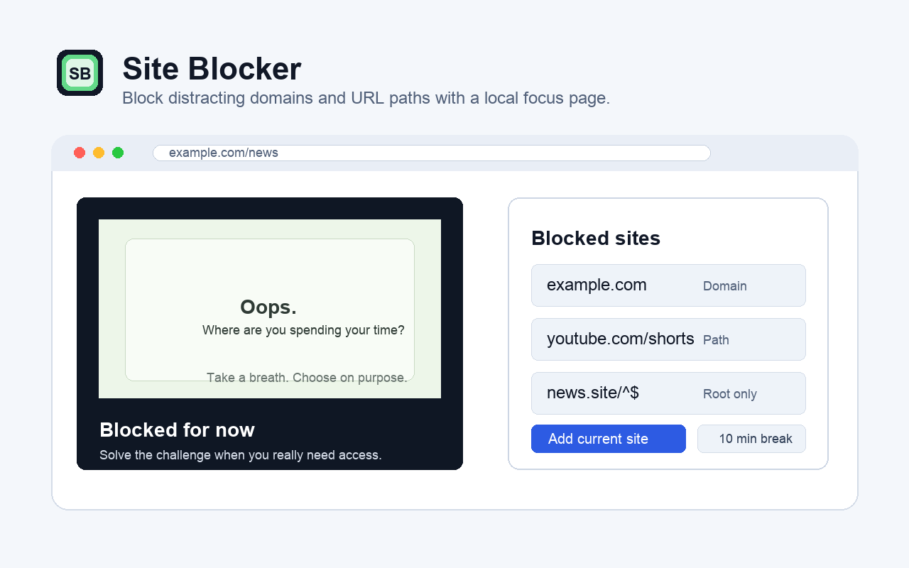

# Site Blocker

Site Blocker блокирует выбранные домены и URL-пути, перенаправляя совпавшие
страницы на локальный экран блокировки. Чтобы вернуть доступ, нужно решить
небольшой математический пример — достаточно неудобно, чтобы остановить
бездумный переход, но не настолько, чтобы потерять контроль.

## Идея

Недавно у меня появилась идея для реально крутого приложения, которое изменило
бы жизнь миллионов пользователей. Для реализации я воспользовался ИИ. Знаете
сколько занял у меня весь процесс разработки - от первого промта до готового
приложения? 47 секунд. Не минут. Не часов. Не дней.

Это не провокация, это новая реальность. Сейчас не нужно иметь образование или
навыки, чтобы воплотить свои идеи в жизнь. Не нужны разработчики, тестировщики,
аналитики. Не нужны бигтехи и корпорации. Достаточно одной хорошей идеи.

Сейчас 60% моих навыков не стоят ничего, зато остальные 40% стоят на 60%
больше. Мы на пороге больших перемен, к которым нужно быть готовым ЗАРАНЕЕ.
Так что не нужно прокачивать харды. Прокачивайте свое окружение, свои связи,
свою сеть контактов.

<p align="center">
  
</p>

## Возможности

- Блокировка целого домена, префикса пути или пути по регулярному выражению.
- Добавление текущего сайта прямо из всплывающего окна расширения.
- Собственное локальное изображение на странице блокировки.
- Временная разблокировка на 5 минут после решения математического примера.
- Работа в Chrome, Edge и Firefox, включая страницы в режиме инкогнито.

## Установка

Расширение пока устанавливается из исходников:

1. Скачайте репозиторий или клонируйте его:

   ```bash
   git clone https://github.com/ltdigor/site-blocker.git
   ```

2. Откройте страницу расширений:

   - Chrome: `chrome://extensions/`
   - Edge: `edge://extensions/`
   - Firefox: `about:debugging#/runtime/this-firefox`

3. В Chrome или Edge включите режим разработчика, нажмите **Load unpacked**
   и выберите папку репозитория.
4. В Firefox нажмите **Load Temporary Add-on** и выберите `manifest.json`.

## Использование

1. Откройте всплывающее окно Site Blocker.
2. Введите правило или нажмите **Add current site**, чтобы добавить текущий
   сайт.
3. При желании выберите локальное изображение через **Choose local image**.
4. Чтобы удалить правило или разблокировать сайт на 5 минут, решите
   математический пример.

### Формат правил

| Правило | Что будет заблокировано |
| --- | --- |
| `example.com` | Весь домен и его поддомены |
| `example.com/news` | Пути, начинающиеся с `/news` |
| `example.com/^$` | Только главная страница сайта |
| `example.com/^articles/[0-9]+` | Пути, совпадающие с регулярным выражением |

Протокол указывать не нужно: расширение работает и с `http`, и с `https`.

## Если что-то не работает

Для диагностики приложите:

- название и версию браузера;
- версию расширения;
- добавленное правило;
- адрес страницы, на которой возникла проблема;
- скриншоты или текст ошибок из консоли.

<details>
<summary><strong>Как собрать логи в Chrome или Edge</strong></summary>

1. Откройте `chrome://extensions/` или `edge://extensions/`.
2. Включите режим разработчика и найдите Site Blocker.
3. Откройте **Details**, затем **Errors**, и скопируйте ошибки.
4. Нажмите **service worker** в разделе **Inspect views**, воспроизведите
   проблему и скопируйте красные или жёлтые сообщения из Console.
5. Если проблема возникает на определённом сайте, откройте его, нажмите `F12`,
   перейдите в Console, воспроизведите проблему и скопируйте сообщения.

</details>

<details>
<summary><strong>Как собрать логи в Firefox</strong></summary>

1. Откройте `about:debugging#/runtime/this-firefox`.
2. Найдите Site Blocker и нажмите **Inspect**.
3. Воспроизведите проблему и скопируйте красные или жёлтые сообщения из
   Console.
4. Если проблема возникает на определённом сайте, откройте его, нажмите `F12`,
   перейдите в Console, воспроизведите проблему и скопируйте сообщения.

</details>

## Разработка

```bash
npm test
npm run package
```

Готовые архивы расширения сохраняются в `dist/`.

| Путь | Назначение |
| --- | --- |
| `manifest.json` | Манифест расширения |
| `src/background/` | Service worker и правила блокировки |
| `src/content/` | Резервная блокировка после загрузки страницы |
| `src/popup/` | Интерфейс всплывающего окна |
| `src/blocked/` | Локальная страница блокировки |
| `assets/icons/` | Иконки расширения |
| `assets/images/` | Изображение страницы блокировки |
| `store-assets/` | Материалы для публикации в магазинах |

## Публикация в Chrome Web Store

Перед отправкой новой версии опубликуйте `privacy.html` по публичному HTTPS-адресу
и укажите его в поле **Privacy Policy** в Chrome Web Store Developer Dashboard:

```text
https://ltdigor.github.io/site-blocker/privacy.html
```

Если GitHub Pages ещё не включён, настройте публикацию корня репозитория из
основной ветки. Затем откройте ссылку в приватном окне и убедитесь, что политика
доступна без авторизации. Как запасной вариант можно использовать публичную
страницу [`PRIVACY.md`](./PRIVACY.md).
